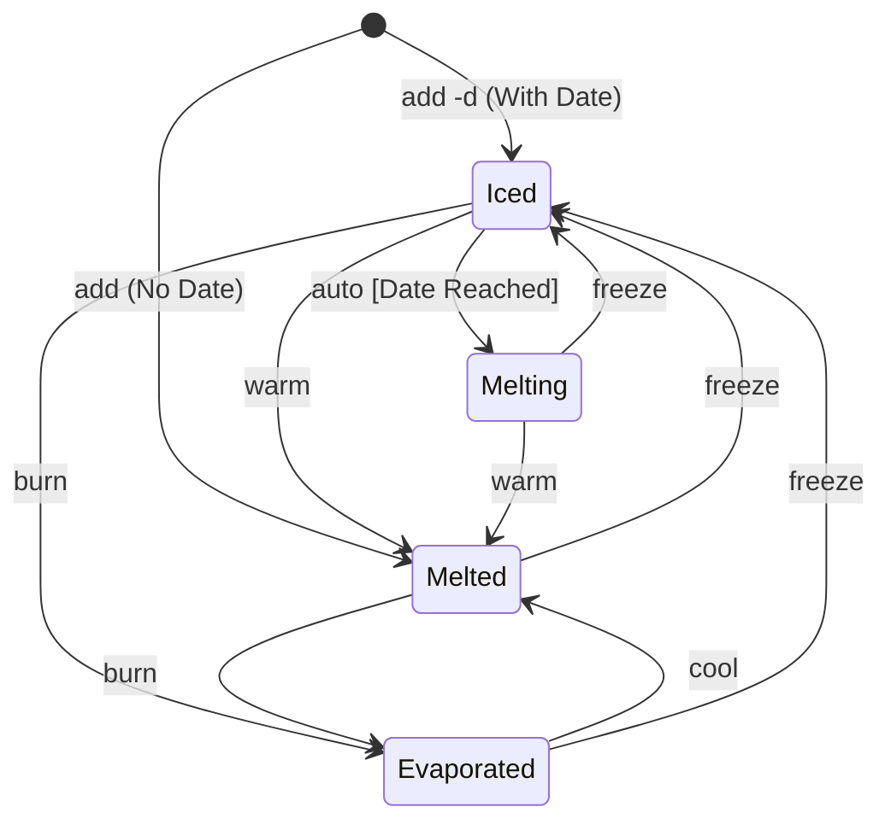

# Kelvin 🌡️

A thermodynamic CLI task manager. Manage tasks as temperature states — freeze what you don't need now, and let them thaw when the time comes.

## Concept

Instead of a traditional TODO list (done/not done), Kelvin manages tasks through **phase transitions**:

| State | Meaning | Analogy |
|:---|:---|:---|
| **Iced** | Frozen — not working on it yet | Solid |
| **Melting** | Thaw date reached — needs decision | Transition |
| **Melted** | Ready to work on | Liquid |
| **Evaporated** | Done | Gas |



## Installation

```bash
cargo install --path .
```

## Usage

### Adding Tasks

```bash
# Add a task ready to work on (Melted)
kelvin add "Fix login bug"

# Add a task with a thaw date (Iced, thaws in 3 days)
kelvin add "Write yearly report" -d 3d

# Add with description and due date
kelvin add "Deploy to production" --desc "Final release" --due 2026-03-01
```

### Listing Tasks

```bash
# Show Melting and Melted tasks (default)
kelvin list

# Show frozen tasks
kelvin list --iced

# Show all tasks
kelvin list --all
```

Output:
```
ID     Task                 State        Thaw Date     Due Date
───────────────────────────────────────────────────────────────────
1      Fix login bug        Melted       -             -
2      Write yearly report  Melting      2026-02-14    2026-03-01
```

### State Transitions

```bash
kelvin warm <id>          # Melting/Iced → Melted
kelvin burn <id>          # Melted/Iced → Evaporated (done!)
kelvin cool <id>          # Evaporated → Melted (undo)
kelvin freeze <id> -d 5d  # Any → Iced (postpone)
```

### Editing & Viewing

```bash
kelvin edit <id> -t "New title"
kelvin edit <id> --desc "Updated description"
kelvin edit <id> -d 3d --due 2026-04-01
kelvin show <id>
```

### Auto-Thaw

When you run `kelvin list` or `kelvin show`, tasks whose thaw date has passed are automatically transitioned from **Iced** to **Melting** — tasks naturally "thaw" over time.

## Configuration

Config file: `~/.config/kelvin/config.toml`

```toml
[defaults]
# Default thaw period for `freeze` when -d is not specified
thaw_days = 7

[storage]
# Custom path for the tasks data file (optional)
# data_file = "~/my-tasks/kelvin.json"
```

## Data Storage

Tasks are stored as JSON at `~/.config/kelvin/tasks.json` by default.

## Date Formats

The `-d` and `--due` options accept:
- **Relative**: `3d` (3 days), `2w` (2 weeks)
- **Absolute**: `2026-03-01` (YYYY-MM-DD)
